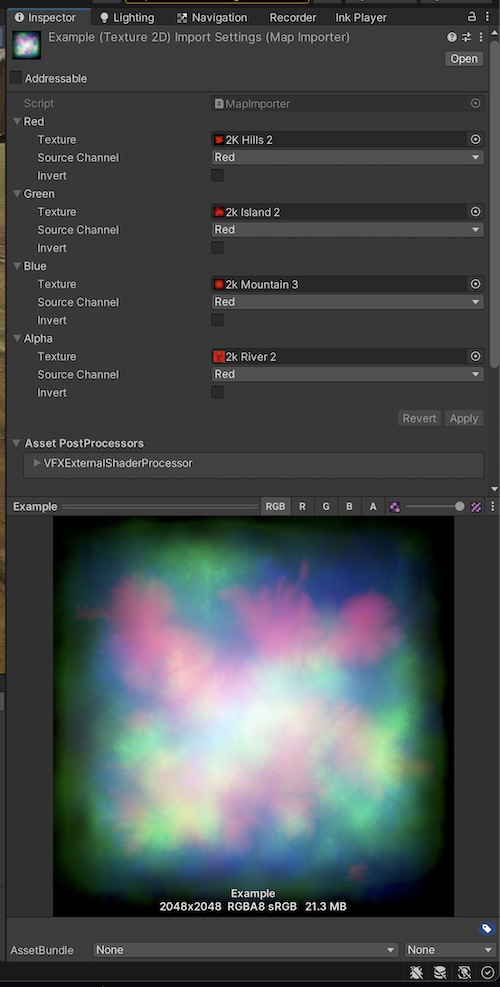

# swizzler (for Unity)

A special importer to merge different texture channels into a final texture output.

Implemented as a ScriptableImporter so you don't have to "bake" the image once – feel free to tweak the settings and keep your source textures in their original format.

Also features an experimental importer that will create PBR materials and terrain layers from a set of texture images.



# Usage

### Packing Arbitrary Channels

- Go to Tools > Swizzler > Create Map
  - This will create a file called "New Map.swizzlermap" in the currently selected folder
- Open the map file in the inspector
- Select source textures and channels
- Press "Apply"
- The map file will now be a valid asset that can be used as a texture

### Creating PBR Materials

(experimental, currently HDRP only but should be easy to add support for other render pipelines all at the same time)

- Navigate in your project to a folder containing PBR material textures
- Go to Tools > Swizzler > Create PBR Material
  - This will look at the files in your folder and try to guess which ones are which, and repack them into a Unity mask map
- Ensure the materials were auto-selected correctly and make any changes
- The .swizzlerpbr asset will contain an HDRP material, mask map, and a terrain layer inside it, which can be used normally like any other asset
  - If you would like to customize the material, simply create a material variant of the imported asset.

## Install

### Using Git

Make sure the Git client is installed on your marchine and that you have added the Git executable path to your PATH environment variable.

Go in %ProjectFolder%/Packages/ and open the "manifest.json" file.

in the "dependencies" section add:

```sh
{
  "dependencies": {
      ...
      "com.wilgieseler.unity.swizzler":"https://github.com/wilg/swizzler.git"
      ...
  }
}
```

Find more information about this [here](https://docs.unity3d.com/Manual/upm-git.html).

### Manual

Download this repository as a zip file, extract the archive. <br>
In Unity, go in "Window" -> "Package Manager" -> "Add Package from disk"<br>
Select the "package.json" file located at the root of the package folder.<br>

The tool is located under "Window" and is called "Channel Packer"

## Note

This is still under development and may be buggy.

## License

MIT. See [LICENSE](https://github.com/wilg/unity-texture-packer/blob/master/LICENSE) for details.
